## **A Devops Project - Automation of Website Deployment using Jenkins On Docker**

In this task, we will learn  to deploy a Website/Webpage uploaded by developer on Github. Every part is Automated using Jenkins which running inside docker container. User even get an email when a Site is deployed.

Task Description-
1. Create container image that’s has Jenkins installed using Dockerfile.
2. When we launch this image, it should automatically starts Jenkins service in the container.
3. Create a job chain of Job1, Job2, Job3 and Job4 using build pipeline plugin in Jenkins
4. Job1 : Pull the Github repo automatically when developers push repository to Github.
5. Job2 : By looking at the code or program file, Jenkins should automatically start the respective language interpreter install image container to deploy code ( eg. If code is of PHP, then Jenkins should start the container that has PHP already installed ).
6. Job3 : Test your app if it is working or not.
7. Job4 : If webpage/Website is working fine, then send confirmation email to developer.
8. Create One extra job Job5 for monitoring. If container where app is running fails due to any reason then this job should automatically restart the container again.

Tools Used-
1. Git and Github- for version control and hosting our repository.
2. Jenkins- to automate various jobs.
3. Rhel8- as a base operating sysytem for running services like docker and ngrok.
4. Docker- to Deploy webpages and jenkins.

### Step 1:  Create Personalized Docker Image with Jenkins Installed in it
We can create personalized Docker image using Dockerfile.

To create a dockerfile I have created a new folder named mydocker

*#mkdir  /mydocker*

*#cd  /mydocker*

*#gedit Dockerfile*

We will create Docker image using centos image pulled from docker hub as shown in the image below

Now, run command to create image

*#docker build -t task2_mlops:v1 /mydocker*

### Step 2: Running a container from the image we created
Use the following command 

*#docker run -it --privileged -p 9999:8080 -v /:/host task2_mlops:v1*
- privileged is used to give container root capabilities of a host machine, allowing the ability to access resources which are not accessible in ordinary containers
- we have set the port 9999 of host machine to access the port 8080 of docker container on which the jenkins works
- -v to connect / of host machine to /host of docker container

### Step 3: Setting up of Jenkins 
- Copy the password given after running the docker image.
- Go to the browser and then enter "Ip of host machine:9999"

After successful completion you will get

Now after creating a github repo and adding all the required files in it we will configure jenkins

### Step 4: Creating Job1 in Jenkins
Job1 will pull the github repository automatically when the developer push any update
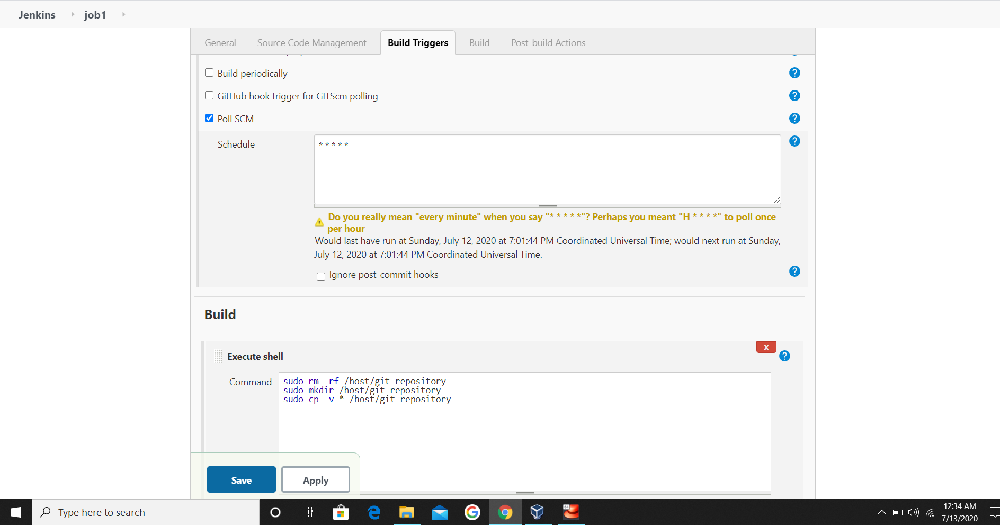
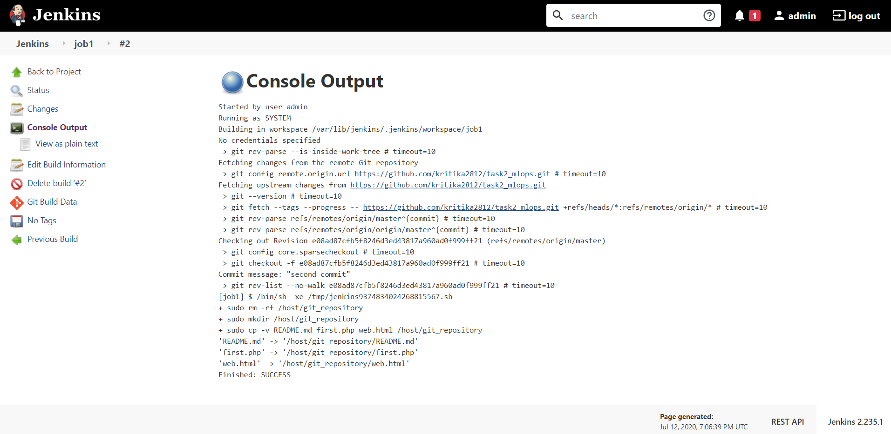

### Step 5: Creating Job2 in Jenkins
Job2 will look at the code or program file, and then automatically start the respective language interpreter installed  container to deploy code i.e If code is of PHP, then Jenkins should start the container that has PHP already installed and if the code is of HTML then jenkins should start container with httpd.

You have to pull httpd image for HTML files or personalised php Images from dockerhub 

*#docker pull httpd

*#docker pull vimal13/apache-webserver-php
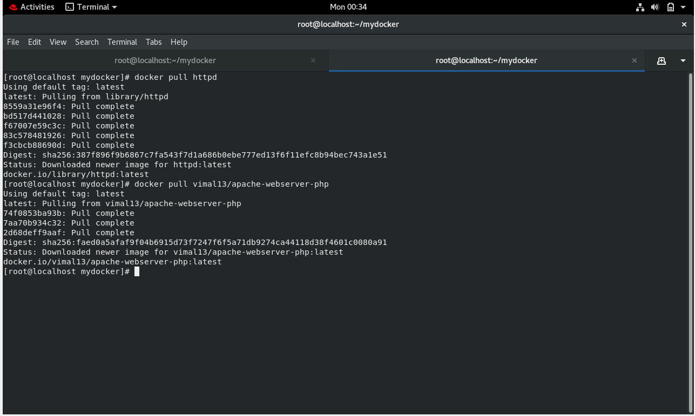

Following is the configuration for Job 2
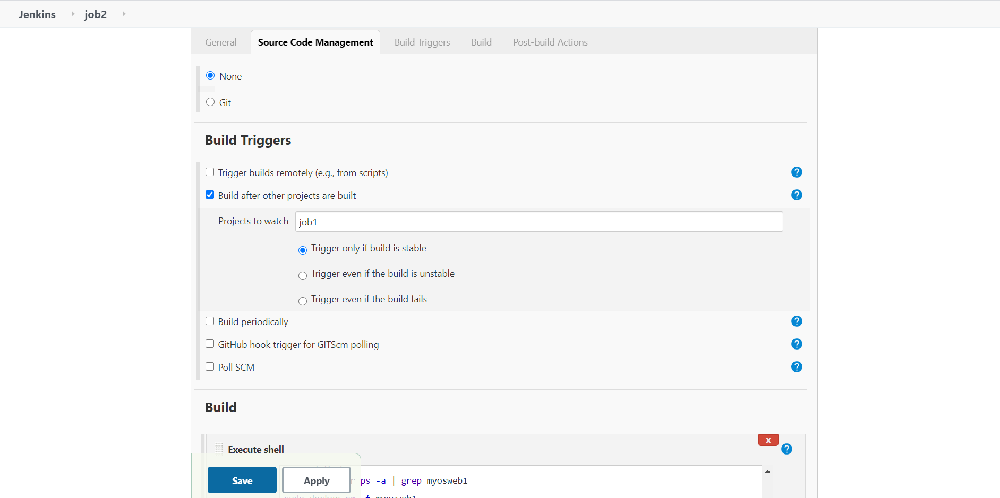
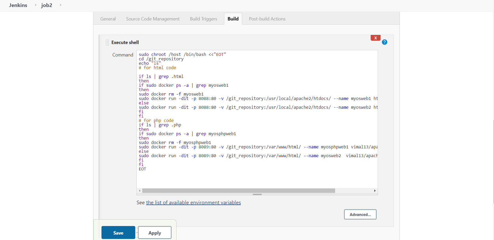

Here *chroot* is used to replicate the directory of docker container to our BaseOS

If everything is working fine You can check the Webpages have been deployed
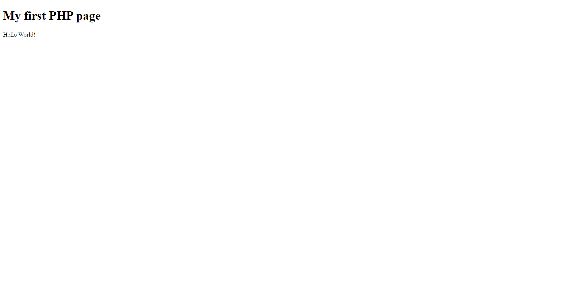

### Step 6: Creating Job3 in Jenkins
Job3 will Test if our websites are working or not
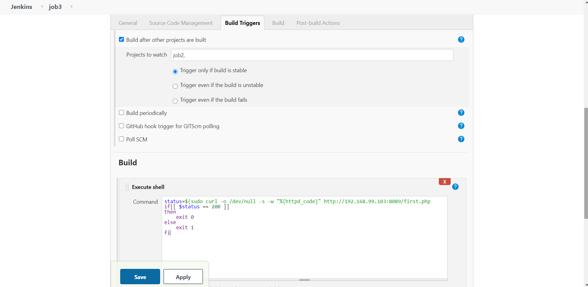
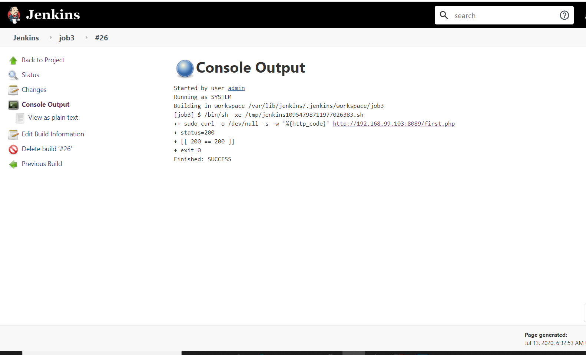

### Step 7: Creating Job4 in Jenkins
Job4 will send the confirmation mail to the developer using python file
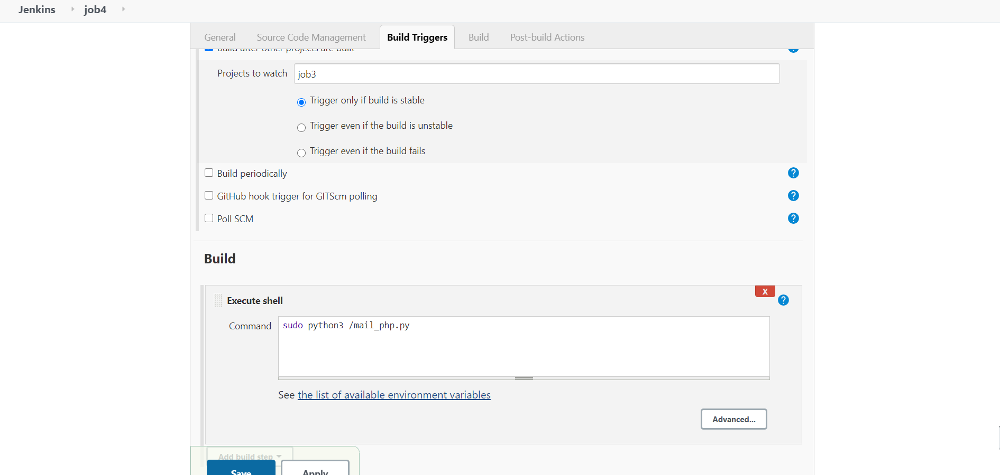

### Step 8: Creating Job5 in Jenkins
This job will monitor If containers where websites are running. If it fails due to any reason then this job should automatically start that respective container again.
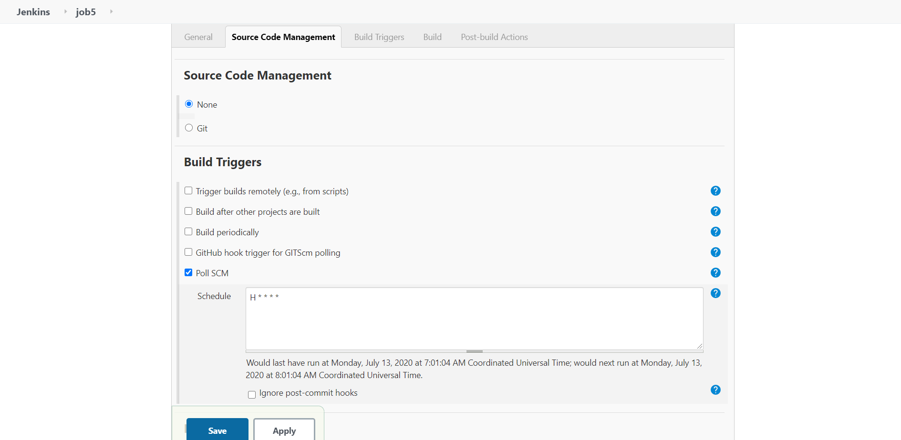
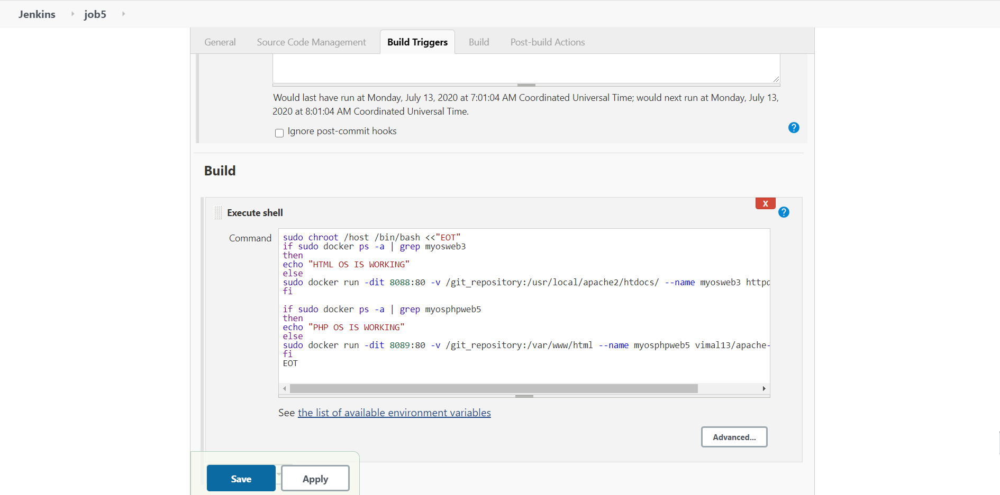

If everything working fine then console output of Job5 will be
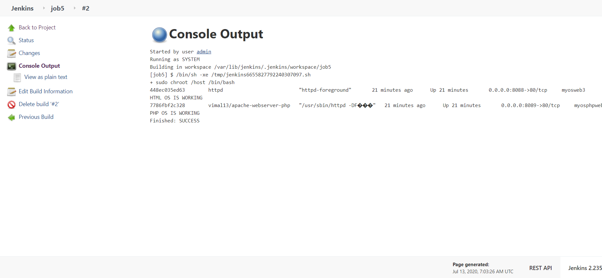

### This is all in this task. Thankyou for Reading my blog

